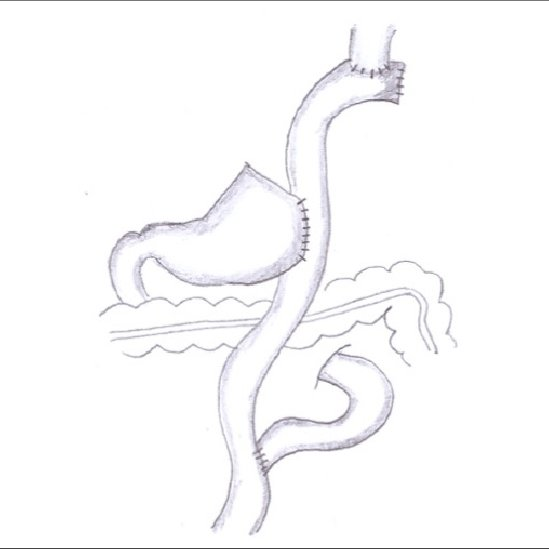

---
output:
  pdf_document: default
  html_document: default
---
# Gastrectomy

## Proximal gastrectomy

Proximal gastrectomy for small proximal tumors can be performed with a dual-tract reconstruction to take advantage of the reservoir capacity of the distal stomach without the risk of gastroesophageal reflux.

{#id .class width=50% height=50%}
